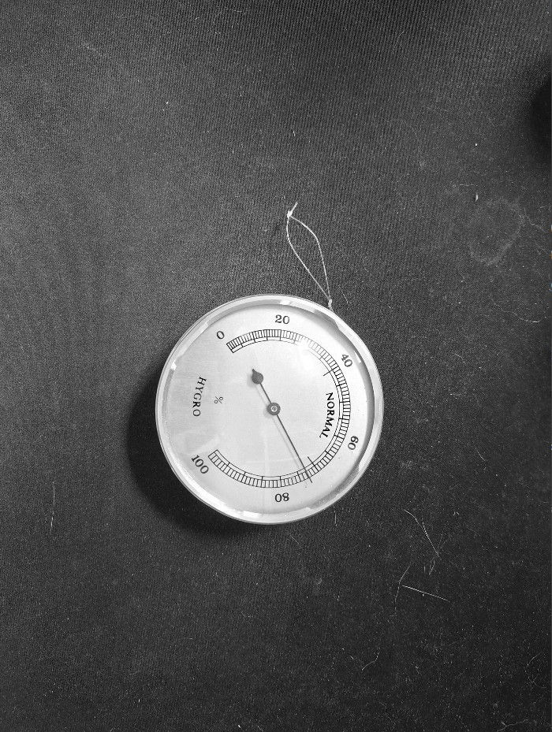
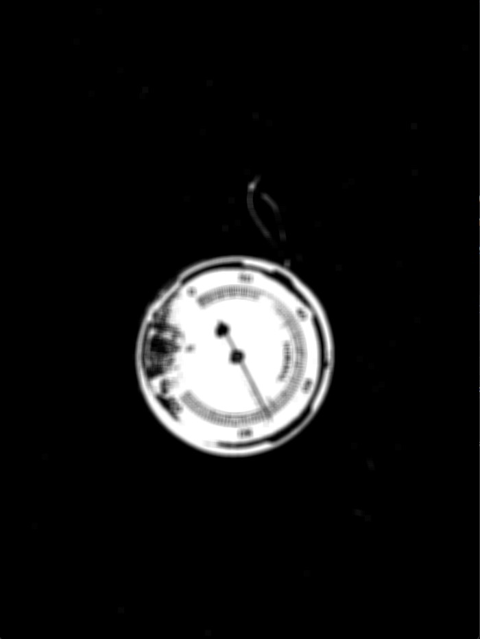
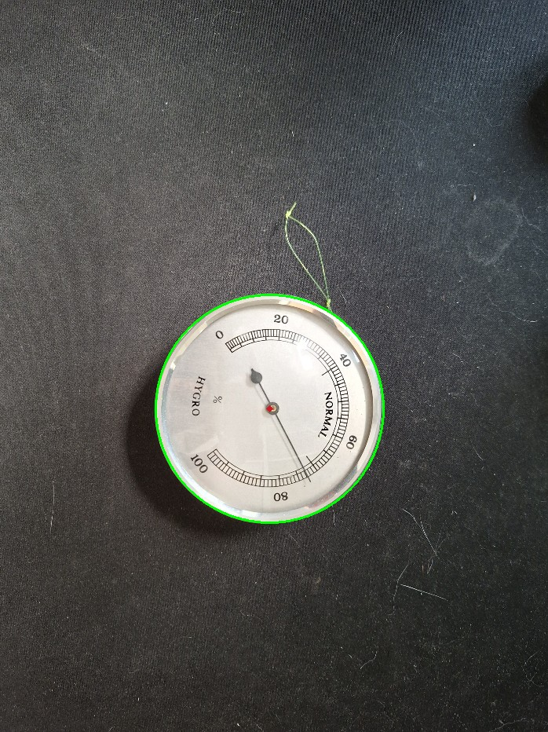
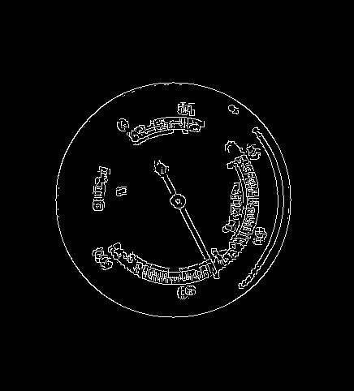
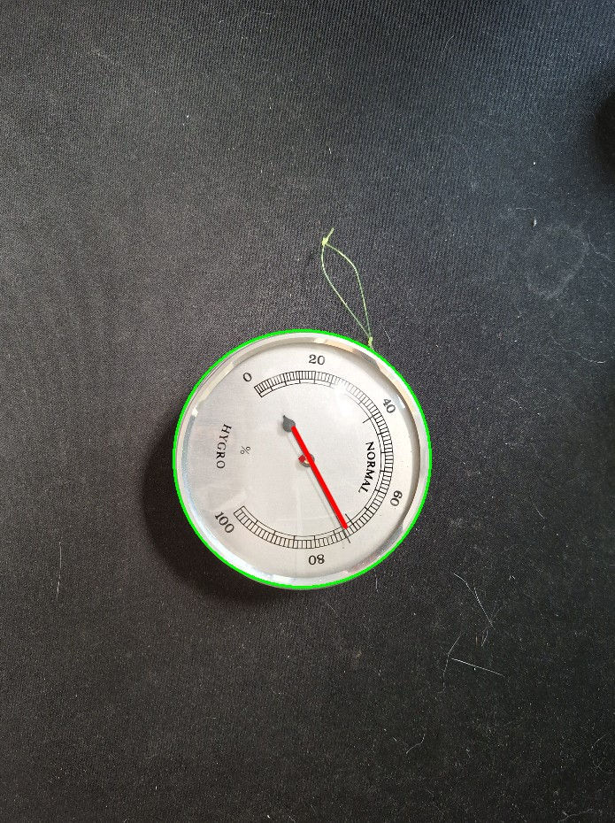
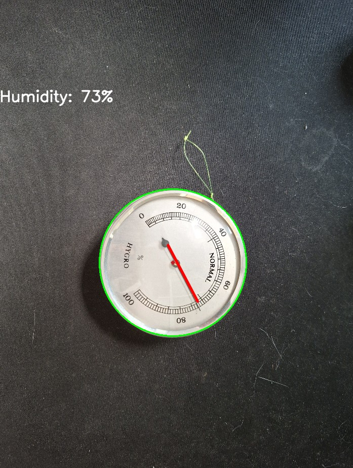

# AnalogueGaugeReader
This repository is for reading out the value of a analogue Gauge, in this specific case a Hygro meter. The idea is that they hygro meter gets read periodically and registers the read values with the datetime time of the reading so that it can be tracked for later analysis.

In this README you will find the different stages/steps of developing the script with the goal described above in mind.

# README Status
Currently the code is further than the README, the README misses the line finding function and the calculation function in its explanation. This will be added some time soon.

# Prerequisites
For following the steps/using this code you need to have certain python packages installed, the required packages can be found in the requirements.txt. To install all of them at once use pip install -r /path/to/requirements.txt .

# Step 1: reading an image
For the reading of images and live webcam feeds as well as the processing we will use OpenCV (https://opencv.org/) this is a package that focusses on providing functions for computer vision solutions.

For early development there is no need to use a livestream constantly, mostly because of convenience, however it will be tested in a later stage with a live camera feed. To do this we will use the opencv function called cv.imread({insert path to image}) with as argument the image we want to use. 

For livestreaming from a webcam make sure to create a capture device using cv.VideoCapture({insert webcam ID or address}) see: https://sandervandevelde.wordpress.com/2024/10/12/recording-rtsp-video-feeds-using-python-and-opencv/ for a detailed guide.

The image below will be used for demonstrative purposes.

# Step 2: Image transformations
The image shown above is pretty big (4000x3000 pixels) since it was taken with a camera. This is overkill for the proposed analysis and can slow the other functions applied to the image. So the image is resized using the function resizeframe, this function uses the image and the width that is wished to rescale the image into the wished for size. To get the original size of the image you can skip this function call. In this README example it gets rescaled to 700 pixels wide. After the rescale we convert the frame into a grayscale image. This will help with finding the gauge, since this is done on contrast. The result is that we have the image below.

This image is already easier to process however if we apply the function cv.HoughCircles (which is the OpenCV function that looks for circles in an image) it would find a lot of circles in the image, probably because of differences between values. To make sure we only look at the area of interest we apply a mask using the maskgrayframe function. This takes the grayimage and sets the pixel values between lowerblackvalue & upperblackvalue to 0 (0 means pitchblack 255 means white for pixel values). To make sure there are no stray pixels that can form a circle together we also apply a blur. This helps with reducing the impact of stray pixels that we are not interested in. See the image below for the result after these transformations.

# Step 3: Detect circles
Using the cv.HoughCircles() command we can find the circles in the image and thus locate our gauge meter. For the command we use the maskedimage and some hyperparameters (these will probably have to be tweaked depending on the use case, look for the documentation from OpenCV for this function for more info). This results in an array with 3 columns containing the center coordinates and the radius of the circle. We draw these points for each of the found circles onto the resized image (with colour) and receive the results shown below.

# Step 4: Outline image
To help the line detection algorithm we will apply a so called canny filter. This will do some edge detection for us and after parameter tuning we get the image below as a result.

# Step 5: Detect the pointer

This section is currently based on the fact only 1 line has been found, there will be a branch at some point where code will be written to detect which lines are of interest.

Similarly to cv.HoughCircles() there is a command in OpenCV that detects lines. This comes in two flavours cv.HoughLines() and cv.HoughLinesP(). The difference is that HoughLines works using the polar coordinate system (radius and angle) and HoughlinesP (the p stands for probabilistic) the Cartesian coordinate system (x and y). HoughlinesP is considered more efficient and gives use the start and end coordinates which is also simpler to work with. Given the the coordinates we can draw the line onto the image, see picture. 

# Step 6: Calculate the angle
The next step is to calculate the angle of our point. This is not that hard to do since we have the 3 required points. we have one that describes the start of the line, one the ending of the line and one the middle of the detected circle. To check which direction we are point we take the bigger value of the formula below:

 $Distance = \sqrt{(X_{in} - X_{circle})^2 + (Y_{in} - Y_{circle})^2}$

 In which $X_{in}$ is the X coordinate of the line point we want to test, $X_{circle}$ is the X value at the center of the detected circle (and the same goes for Y)

This gives us two distances (one for each end of the detected line), by taking the maximum one we know which side is the direction the line is pointing in. Given this information we can calculate the angle between the detected line and the middlepoint of the circle by using the function described below.

$pointerangle = arctan2(Y_{in}-Y_{circle}, X_{in}-X_{circle})$

This angle will give use the angle between the positive X-axis, actually we get the wrong angle (the Y value should be negative resulting in a negative angle) in this case ~57.53 degrees. However this works out later on, since instead of subtracting the negative angle, we can add the positive one. This angle is then added to the offset angle of the measurement reading. In this example the offset is 140 degrees (the 0% reading is 140 degrees in positive rotation). This results in a total angle of ~197.53 degrees. The total range of the readings (0% to 100%) is 270 degrees. We can calculate the reading by using the formula below.

$hygroreading =  totalangle / 270$

In this case the hygro reading is about 73%! Looking back at the very first image, this seems to match pretty well (considering I compensated the offset angle by knowing the true value, which is very cheeky, but we will solve this problem in another section once I found a reliable way to solve this).

# Step 7: Using the webcam for the readings

After some tweaking and setting the camera and light source up I managed to get a pretty good reading of the meter (once again disclaimer that the offset angle is cheated). This setup has proved to be very sensitive though to the light source, surrounding area, angle of the meter and parameters chosen. Therefor the setup will probably have to be tweaked in every setting and monitored for a decent amount of time to make sure it will consistently work. But with all these conditions kept in mind the video below is created from using a USB webcam feed!

https://github.com/user-attachments/assets/c6d5004f-3fcf-4b46-b434-8379c2947cbd

# Step 8: Use MQTT to communicate data

We are starting to work towards a real IoT solution for real time intelligence, but it's missing one of the most crucial things. Communication over an internet connection! In this project we will use MQTT to communicate the data. I will not go too much into detail about how to set it up, maybe I will if people would find it interesting. For testing I just used the localhost adress and the standard port. To see the results I used MQTT explorer (https://mqtt-explorer.com/). MQTT requires something called an MQTT broker in this case I installed Eclipse Mosquitto (https://mosquitto.org/). Basically, I need to run the code, the code will create a package of information that is then published to the MQTT broker, which then publishes it to the client. The result looks like this in MQTT explorer (the images update slower because I added a sleep function to reduce computational resources used).

https://github.com/user-attachments/assets/5b076dad-6363-4f84-b03b-d32507b5ec7a

